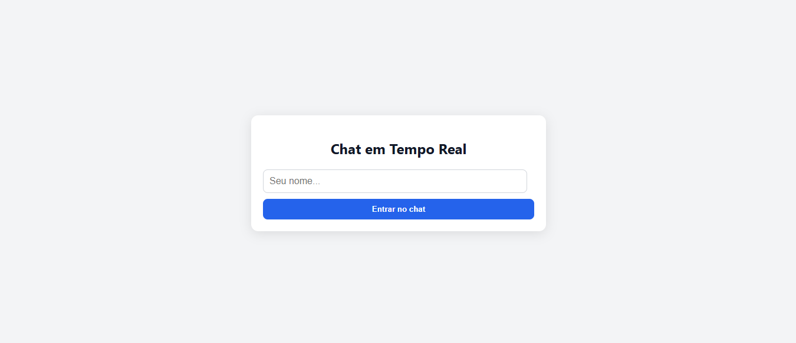
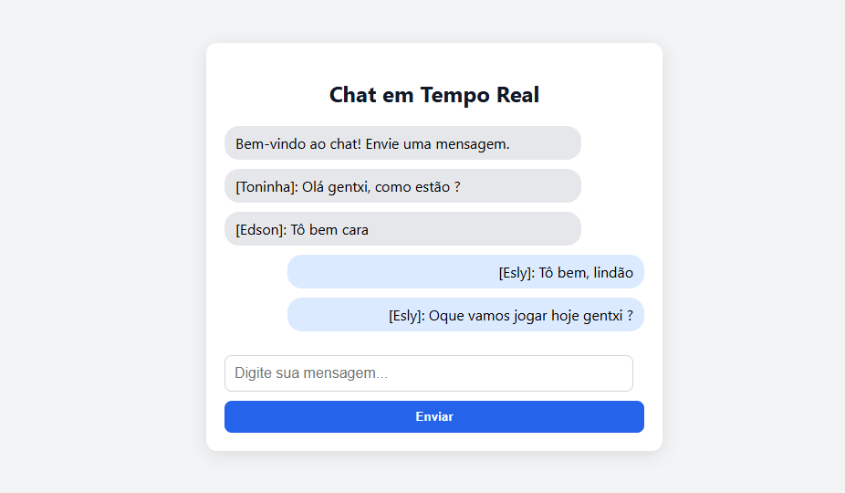

# Exemplo de WebSocket Redes II
## 📡 Chat em Tempo Real com WebSocket

Este projeto é um exemplo simples e funcional de um **chat em tempo real** usando **WebSocket com Node.js** e interface web em HTML/CSS puro.

---

### 📌 Funcionalidades

- Conexão persistente entre cliente e servidor via WebSocket.  
- Comunicação bidirecional em tempo real.  
- Interface amigável com entrada de nome do usuário.  
- Diferenciação visual das mensagens enviadas pelo próprio usuário.  
- Design responsivo e moderno com CSS puro.

---

### 🛠️ Tecnologias Utilizadas

- Node.js  
- WebSocket (ws)  
- HTML5  
- CSS3 (estilização customizada)  
- JavaScript (vanilla)

---

### 🚀 Como Executar o Projeto

1. Clone o repositório:

```bash
git clone https://github.com/eslycaetano/exemploWebSocketRedes2.git
cd exemploWebSocketRedes2
```


2. Instale as dependências:

```bash
npm install
```

3. Inicie o servidor WebSocket:

```bash
cd src
node server.js
```

> O servidor será iniciado em `ws://localhost:8080`.

4. Abra o arquivo `index.html` no seu navegador (clique duas vezes ou use Live Server no VS Code).

5. Basta agora testar, com o `index.html` aberto em diferentes paginas, entre no chat com diferentes nomes e use.

### 📸 Prévia do Projeto



---

### 📂 Estrutura do Projeto
```bash
├── src
  ├── server.js          # Servidor WebSocket com Node.js
  ├── index.html         # Interface do chat (cliente)
  ├── style.css          # Estilos da interface
├── README.md          # Este arquivo
├── package.json       # Dependência da lib ws
```
---

### 🧠 Referências Técnicas

- [RFC 6455 – The WebSocket Protocol](https://datatracker.ietf.org/doc/html/rfc6455)  
- [Node.js WebSocket (ws)](https://github.com/websockets/ws)  
- [MDN WebSocket API](https://developer.mozilla.org/pt-BR/docs/Web/API/WebSocket)

---

### 📬 Contribuindo

Sinta-se à vontade para abrir issues ou enviar PRs com melhorias, correções ou sugestões. 🤝

---


